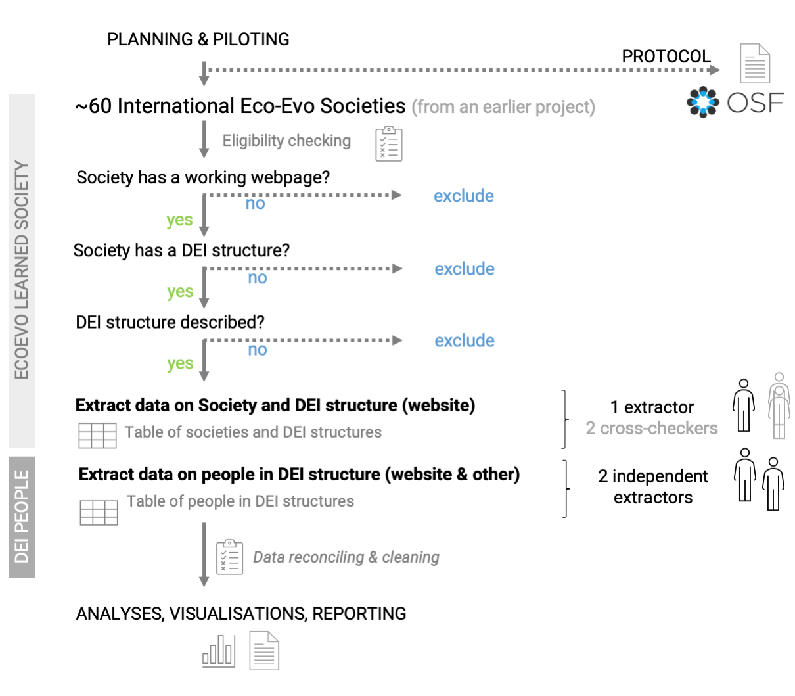
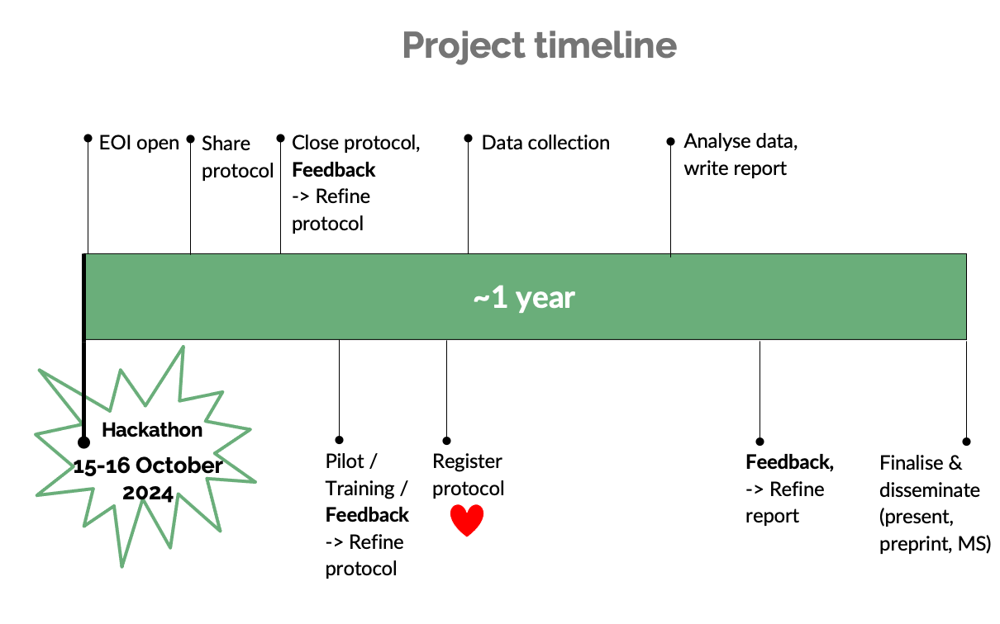

# Diversity of DEI committees across international learned societies in Ecology and Evolutionary Biology 

**Our mission statement:** *Making science more equitable and open.* 🌟  

  

(If you are reading this on GitHub, you can also see this repository as a webpage [here](https://mlagisz.github.io/survey_EcoEvo_societies_DEI/)🌍).   

## 🔖 Background   
Learned societies lead and support researchers from around the world. They are often at the forefront of culture change in the research community. However, they can also unintentionally entrench and propagate existing biases in academia. For example,  members of traditionally underrepresented and marginalized groups may be subject to a ‘minority tax’ when they are tasked with fixing the system which has been set up by people with extreme privilege. Such tasks are often associated with the DEI (Diversity, Equity and Inclusion) committees, or similar structures (e.g. DEI officers). However, currently there only exists anecdotal evidence on the composition of the DEI structures in terms of gender and other characteristics that could be interpreted as indices of diversity and representation. As such, characterizing diversity and fepresentaion within DEI structures can provide tangible evidence on potential biases and a base for advocacy to rectify such biases. In this project, we will focus on international learned societies in the fields of Ecology and Evolutionary Biology (Eco-Evo).  

## 🏹 Aims and approach  
This project aims to evaluate types and sizes of the DEI-related organisational structures and assess potential biases in the composition of members and leaders of these DEI structures. We will conduct a survey of a sample of international Eco-Evo societies with publicly available information on DEI structures. Our findings will be openly available and disseminated in the research community.      

## 🪓 Impact  
We expect that our findings will contribute to culture change fostering more equitable and open science.    

## 💎 Team  
We have an diverse and open team of early- and mid-career researchers contributing to this project. We warmly encourage contributors from traditionally underrepresented and marginalised groups in research.

Currently, the team is finalised and we no longer accept new contributors. Please get in touch if you are interested in contributing to our future projects.

## 💛 Contributing  
Overall, when you work with us:   
- We welcome researchers with all backgrounds and walks of life to contribute.   
- You do not need any special research skills - just attention to detail, Internet access and some time available.   
- You will need to fill in the Expression Of Interest (EOI) form to provide us with your details. If you would like to join us and are from traditionally underrepresented and marginalised groups in research, please let get in touch with the project leads for the link to the EOI form.   
- We already had an initial virtual hackathon (an intial information and feedback meeting) in October 2024, but we can schedule additional virtual meetings if you feel like you would like to chat with the leaders or other project participants. Send your suggestions!  
- We do all the work asynchronously online until we complete all tasks of the project.    
- For more details on how to contribute and how we deal with recognizing everybody's contributions see our full [CONTRIBUTION GUIDE](/CONTRIBUTING.md).  
- We expect all project contributors to familiarize themselves and follow our [CODE OF CONDUCT](/CODE_OF_CONDUCT.md).   
- If you would like to comment on this project or provide suggestions to improve it, feel free to open an issue on GitHub, reach directly to us via email or a dedicated SORTEE (Society for Open, Reliable, and Transparent Ecology and Evolutionary Biology, www.sortee.org) Slack channel (join SORTEE and get invited to their Slack workspace, then join channel #conf2024-h05-diversity-of-dei-committees-across-international-learned-societies).
- We will periodically send you updates on the project progress. Our main way of communicating is via emails and comments on shared Google Docs (used for data collection). We will email specific contributing instructions to the project participants for the project tasks they are assigned to.
- We will also provide clarifications and answer questions via email and dedicated Slack channel, as needed (please get in touch when you need help or explanations). Importantly, please let us know when you are stuck or you do not have time to finish a given task, so we can find replacement and keep moving forward. 
- All contributions to this project are voluntary. We will not provide financial remuneration for any contributions (this project has no dedicated funding).
- You can withdraw from the project at any time.  

## 🗺 Workflow

## 📅 Timeline

## 🚉 Current status    
Data collected. Preliminary data analyses.      

## 🚀 Protocol   
Final protocol will be publicly archived on [OSF](https://osf.io/8465y) with [DOI](https://doi.org/10.17605/OSF.IO/8465Y).    

## 🚚 Supporting information 
Supporting information for this project will be publicly available at [LINK to be added].    

## 💻 Data and code files      
A copy of our final data and code files will be publicly availabe at [LINK to be added].     

## ⏰ Code of Conduct   
We expect all project contributors to familiarize themselves and follow our [CODE OF CONDUCT](/CODE_OF_CONDUCT.md).      

## 🔧 Maintainer(s)
* [Losia Lagisz](https://github.com/mlagisz).   

## 🖍️ License 
This work is licensed under a [Creative Commons Attribution 4.0 International License (cc-by)](/LICENSE.md).   
